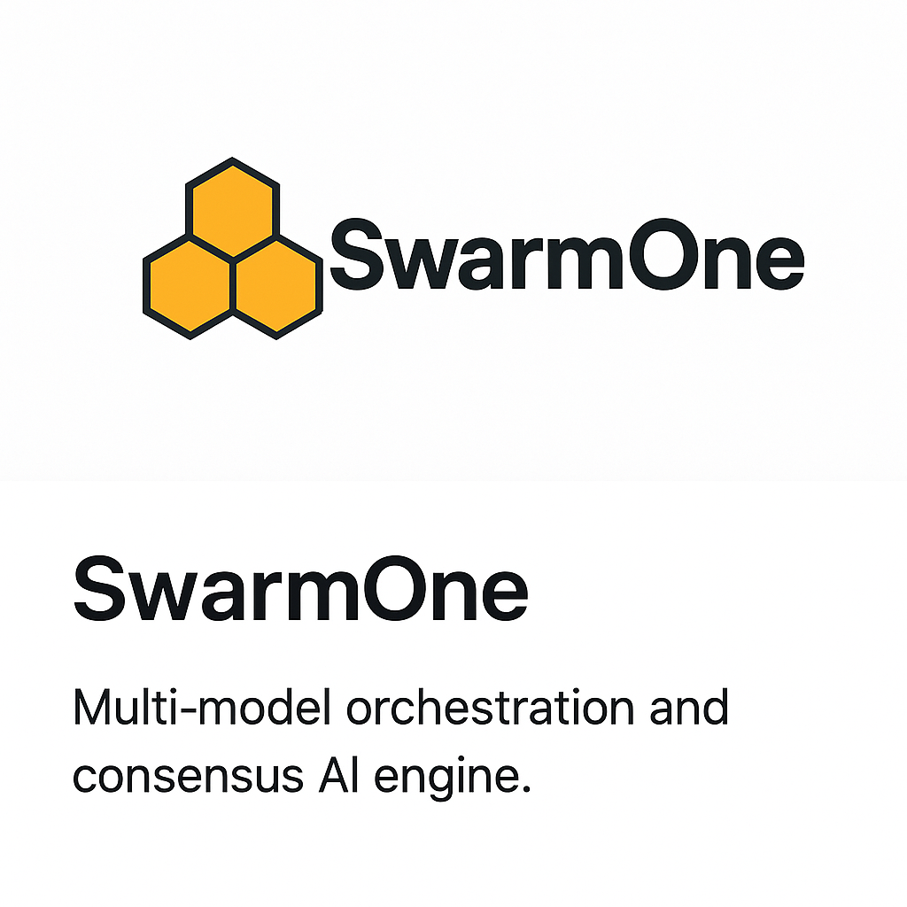

# SwarmOne

**Multi-model orchestration and consensus AI engine.**

---

## Overview

SwarmOne is a modular orchestration framework that runs multiple LLM candidates (OpenAI, Anthropic, Gemini, etc.) in parallel, applies scoring/voting logic, and selects a high-confidence consensus output. It enables fault tolerance, provider abstraction, and cost-aware decision making in multi-model AI environments.

---

## Features

- ⚙️ **Parallel execution of LLM candidates** via unified API abstraction (OpenAI / Claude / Gemini / etc.)
- 🧠 **Consensus engine** with scoring, weighted voting, fallback heuristics
- 🔄 **Resilient multi-backend design** with retry, circuit breaker, and failover support
- 📊 **Web console** for prompt testing, run tracing, A/B comparison, and error debugging
- 💰 **Token-level cost tracking** with support for caching and adaptive routing
- 🚀 **Extensible SDK and REST API** with correlation IDs, structured logs, and consensus metadata

---

## Tech Stack

- **Backend:** Gin (Go), gRPC, Postgres
- **Frontend:** React, Vite, TypeScript
- **LLM Providers:** OpenAI, Anthropic (Claude), Gemini
---

## Example Use Case

```bash
POST /v1/ask
{
  "Task": "reply email",
  "Content": "reply to comfirm when to meet with Jack, either at Mon 2:00pm or Tue 10:00am",
  "Expections": "Professional; concise",
  "Source": "",
  "Language": "en-US"
}
```

Response includes:
- Final answer
- All candidates
- Scoring breakdown
- Consensus metadata

---

## Getting Started

```bash
git clone https://github.com/yourname/swarmone.git
cd swarmone
```
Create your backend/.env:
```bash
OPENAI_API_KEY=
GOOGLE_API_KEY=
ANTHROPIC_API_KEY=

JUDGE_PROVIDER=
JUDGE_MODEL=
JUDGE_MAX_TOKENS=
```


```bash
cd backend
go mod tidy
go run ./cmd/swarmoned
```

```bash
cd frontend
npm install
npm run dev
```

Visit `localhost:5173` to access the frontend.

---

## License

MIT License © 2025